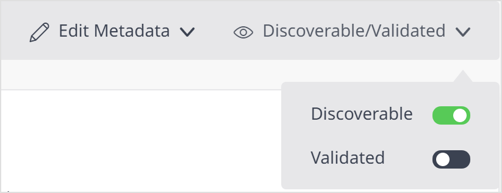
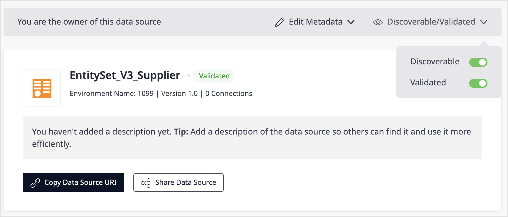
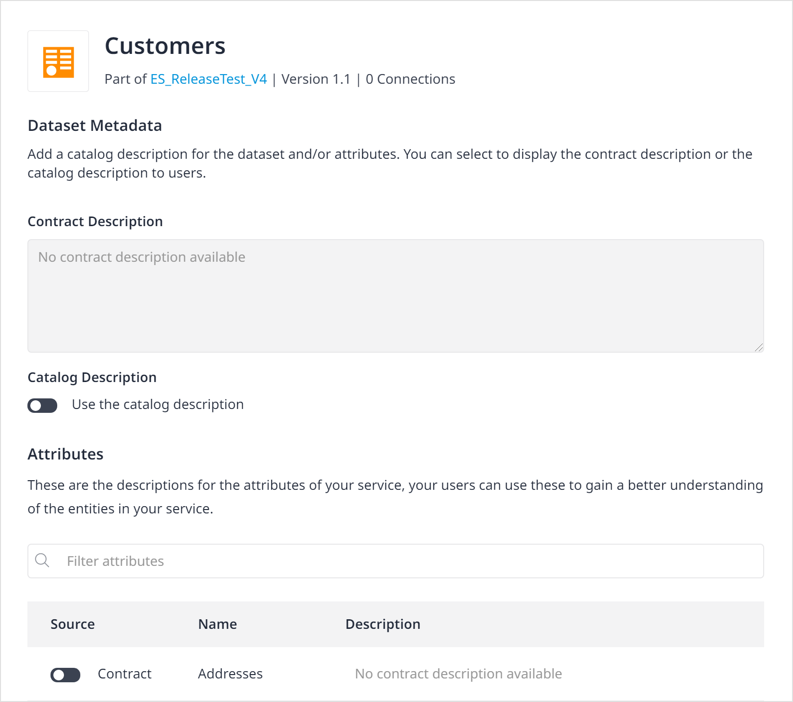

## 1 Introduction

Curation is the processes of maintaining registered services and enriching the metadata of registered assets in the Data Hub to provide further information about the services as well as the datasets and attributes exposed in the services. You can add catalog descriptions and tags to supplement the registered metadata in order to categorize the asset and the datasets they connect to. Curate functions include setting the [Discoverability](#discoverability) of registered assets, assigning a **Validated** tag and specifying the **Business** and **Technical** owners. 

Users who can curate assets in Data Hub Catalog are as follows: 

* Owners of a registered service – can curate their own services and find those that are set to non-**Discoverable**
* [Data Hub Curators](../index#curator) and [Data Hub Admins](../index#admin) – can curate and find all registered assets, discoverable and non-discoverable

Owners and Curators can also get an overview of the registered assets they own and curate from the [Curate](#curatelist) tab of Data Hub.

{}
Information that is added or changed during curation is stored in the Data Hub Catalog for that item. It will not be added to the OData service contract or metadata files or affect any of the values in the metadata files associated with the service or the data associated with the exposed datasets. 
{}

## 2 The Curate List {#curatelist}

Owners and curators of registered assets can click **Curate** from the **Data Hub** screen to see the **Curation List** screen which provides an overview of all the registered assets (**My Assets**) that you can curate as an owner and **Company Assets** that you can curate as a curator:

The list includes registered services and also individual datasets that are exposed in the services.

From the overview, you can see details of assets, and determine if assets have to be further curated. 

You can search for specific assets by entering a search string in the search bar or **Filter By:** **Environment** or **Validated** assets.

The list can be also be sorted by any of the columns by clicking on the column header.

To go to the asset details, click **View**. You can then perform curate actions to add Catalog specific information to the asset metadata.

## 3 The Curation Bar

Curation is performed in the search details screen. Users with curation rights will see the **Curation Bar** in the **Search Details** screen of the selected item: 

{}
Owners of registered assets and can only curate their services.
{}

On the **Curation bar**, the following details are displayed:
* Information about the role of the current user: **owner** or **curator**
* When a service is selected in the **Search Results**: 
	* **Edit Metadata** – edit the description of the service and datasets, add tags or specify Business and Technical Owners
	* **Discoverable/Validated** – set the service as **Discoverable** and **Validate** from the drop-down menu. 
	 * **Discoverable** defines whether the service can be found (and consumed) by users of the Data Hub; if a service is set to **Non-discoverable**, only the owners of the service (**Business** and **Technical**) can find the registered service. 
	 * **Validate** indicates that the service and data set have been validated.
* When a dataset is selected in the **Search Results**
 * 	**Edit Dataset Details** – to edit the dataset and attribute descriptions 

## 4 Discoverability and Validating {#discoverability}

### 4.1 Discoverable

By default, when an asset is registered in the Data Hub catalog, it is set to **Discoverable**, which means that all users can find, consume, and see details of it. 

When the **Discoverable** setting is turned off, it will only be visible to the owners of the service and curators and not be visible to other users of the Data Hub. This means that it cannot be found, either in the Data Hub Catalog or by users of the Data Hub integrations in Studio Pro and Studio.

{}
When a data source is set to non-**Discoverable**, neither the data source nor the datasets that are exposed in the service can be found by other users (except for curators who can see all assets). However, there may be instances of the same datasets, from the same apps, being available through other services that are also published in the Data Hub Catalog.
{}

To change the discoverability of a service, follow these steps:

1. In the Data Hub Catalog, select the service to display the **Search Details**.

2. If you have curation rights, the **Curation Bar** will be displayed. Click **Discoverability** to display the **Discoverable** toggle:

	

3. Click the **Discoverable** toggle to turn it on or off. A message will be displayed to indicate the discoverability of the asset.

	 

### 4.2 Validated {#validated}

The **Validated** value can be assigned to a data source. When it is turned on, by clicking the **Validated** toggle, this will be indicated in the asset details screen and also in the search results pane for the service. 

## 5 Curating Services 

A service can be curated to specify the owners of the app and also add or edit the descriptions and tags for the selected service. 

### 5.1 Changing the Technical and Business Owners of an App {#customowner}

By default, the **Technical Owner** for a registered asset is the user who registered the service when registration is done through the deployment pipeline in Studio Pro or specified during manual registration or using the Data Hub API. Services can be curated to change the owners. The **Technical** and **Business Owners** are displayed as a link in the asset **Metadata** pane so that users can contact them. 

{}
If you as a **Technical Owner** curate the asset and change the name, then you will no longer have curation rights to the asset once you save the changes. If the discoverability is turned off for the asset, then you will not be able to find the asset in the Catalog.
{}

{}
**Business** and **Technical Owners** have curation rights for the registered data source in the Data Hub Catalog if they are registered users on the Mendix Platform. If a custom owner is *created* with the process described in this section, the link to contact them will be displayed for the asset but this does not mean that they are able to curate it. 
{}

{}
Curators and the Data Hub Admin can manage the custom owner details in the **Owner Management** screen as an **Administration** function. For further details see the [Managing Custom Owners ](../general/data-hub-admin-functions#customowners) section of *Data Hub Administration*. 
{}

To change the owners of the app for the selected service, follow these steps from the service details screen:

1. In the **Curation Bar** click **Edit Metadata** > **Application Details**:

	

2. The **Application Metadata** dialog box is displayed. To change the **Business Owner ** or **Technical Owner** click in the name field and you can start typing or select from the drop-down list of names:

	
	
3. In this list you will be shown a list of Mendix platform users (who will be displayed with the their avatar), and custom owners will be shown with an initial avatar:

	

4. If you type a name that is not on the list, you will be asked if you want to **Create** it.  Click on this prompt and the **Create new contact** dialog box is displayed:

	

5. Enter the **Name** and **Email** of the owner and click **Save**. 

	{}The contact details that you add here will be shown as link for the application in the **Metadata** pane; this does not mean that they are able to curate the asset. For this they have to be a Mendix user.
 {}

6. Click **Back to...** to return to the asset details screen where you will see the link to the new owners in the **Metadata** pane.

### 5.2 Data Source Description

If a description was included in the OData metadata contract, this will be displayed in the **Search Details** screen for the selected data source. You can curate a data source to add a catalog description to include further details on data usage and relevancy. As search in the Data Hub Catalog also includes searching the contents of the description fields of registered services, datasets, and attributes, adding relevant descriptions can help in the right users finding these shared assets.

You can also specify if the OData service **Contract Description** or the **Catalog Description** is displayed in the Data Hub Catalog. 

{}
If there is a **Catalog Description** for a service, both descriptions will be registered for the service in the Catalog and during curation either the catalog or the contract description can be selected to be displayed. 
{}

To edit the asset metadata, follow these steps: 

1. In the **Curation Bar**, click **Edit Metadata** > **Service Details** to display the **Service Metadata** box:

	

2. The description from the OData service metadata is displayed in the **Contract Description**. This cannot be changed, as it is part of the OData service definition. You can provide an alternative description by toggling **Use the catalog description** to display the **Catalog Description** box: 

	

3. Add a catalog description. This will be stored with the service details in the Catalog. 

	{}If a **Catalog Description** has been given for a service, both descriptions will be registered with the service in the Catalog. If you have selected to display the **Contract Description**, the **Catalog Description** will be retained providing the option for curators to display this as desired.
	{}

5. Click **Save Changes** to save the changes that you have made to the **Edit Service Metadata** screen and return to the **Service Details** screen, which will now display the selected description.

	{}If you leave an **Edit Metadata** session without saving your change, you will loose all the changes from that session. {}

### 5.3 Adding or Editing Tags to a Service {#tags}

Add tags to categorize a registered service and provide additional means for finding the service. Tags that are specified for a service also apply to the datasets and attributes that are exposed in the service. Specify tags for the selected service by following these steps:

1. In the **Search Details** screen of a selected service, click **Edit Metadata** > **Service Details** in the **Curation Bar** to display the **Service Metadata** box.

2. To add tags, click the empty **Tag** input area:

	

3. To add or edit the tags, enter a tag string and press **Enter** or select one from the list of existing tags that are used in the Data Hub Catalog and displayed when you start typing in the **Tag** field. Tags can be made up of alphanumeric and underscore characters. To separate multiple tags, use spaces.

	{}Tags can only contain lower-case letters, numbers, and underscores. They must have a minimum of 2 characters. 
	{}
	
	{}If you use capital letters when typing the tag string, they will be converted to lower-case.
	{}

4. You can enter multiple tags separated by spaces. You can remove tags by clicking the **x**:

	

5. When you are finished specifying the tags, click **Save Changes** to register the changes and the tags will be shown in the **Service Metadata** pane.

	{}
	If you leave an **Edit Metadata** session without saving your change, you will loose all the changes from that session. {}

## 6 Curating Datasets and Attributes

Datasets and their exposed attributes can be curated to add **Catalog descriptions**. Catalog descriptions are stored in the Data Hub Catalog and it is possible to specify if the description provided in the service contract metadata or the Data Hub Catalog descriptions are displayed for the item.

To change dataset and attribute descriptions, follow these steps:

1. In the **Search Details** screen for the selected dataset, click **Edit Dataset Details** on the **Curate** bar to display the **Dataset Metadata** box:

	

2. The service metadata contract description is displayed. To edit and use a **Catalog Description**, click the toggle and enter a description. 
3. When there are a large number of attributes for a dataset, you can use the search area to find specific attributes.
4. Click **Save Changes**. 

	{}If a **Catalog Description** has been specified for a dataset or attribute, this will be retained even if the toggle is set to display the **Contract Description**. 
	{}
