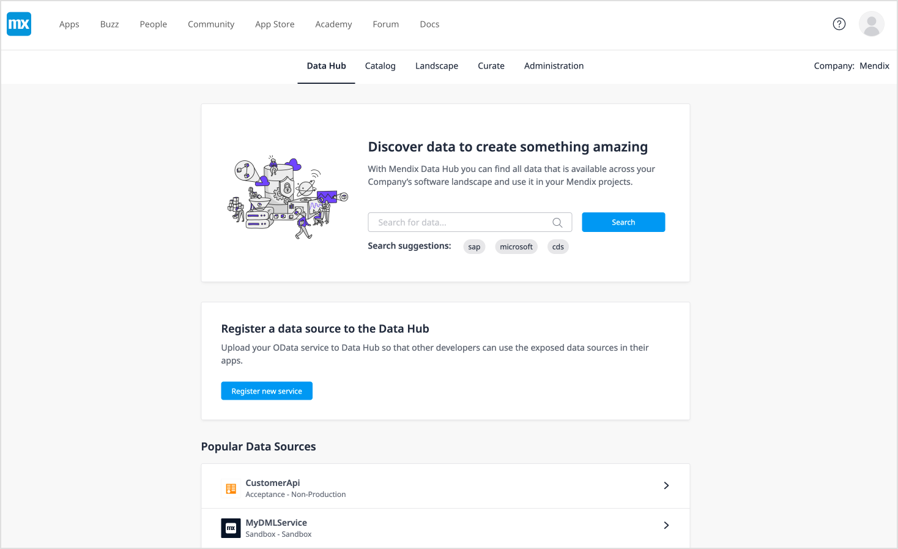
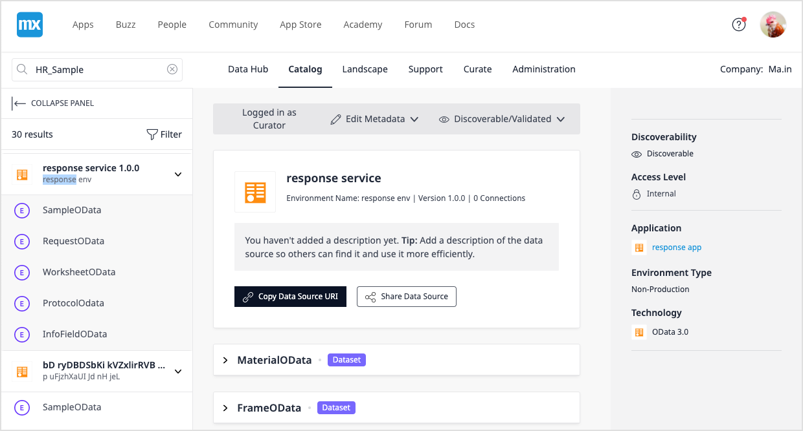
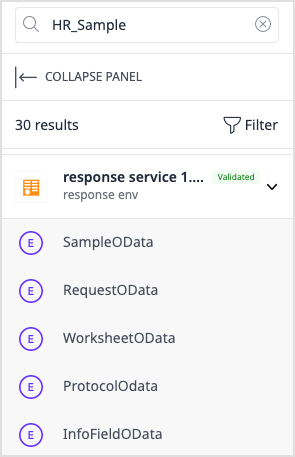
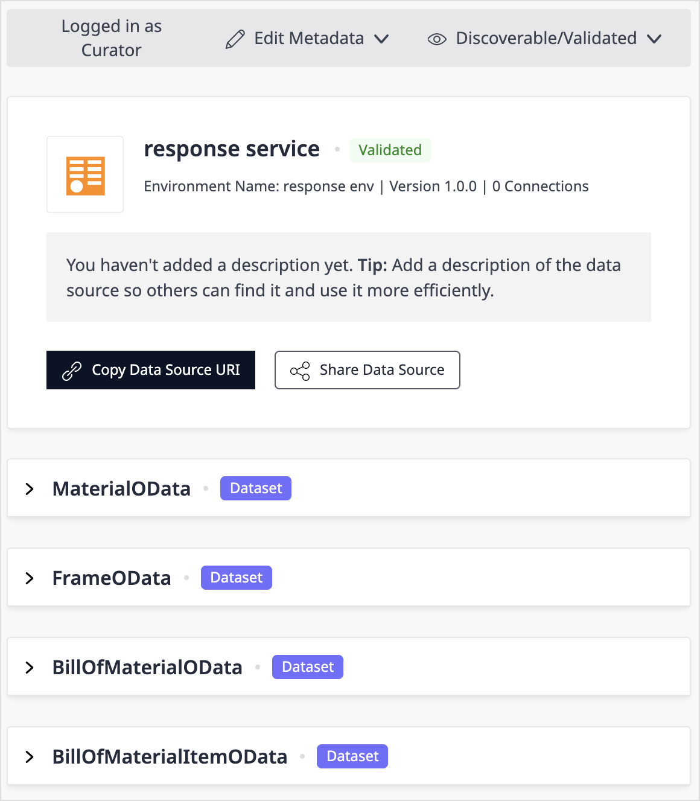
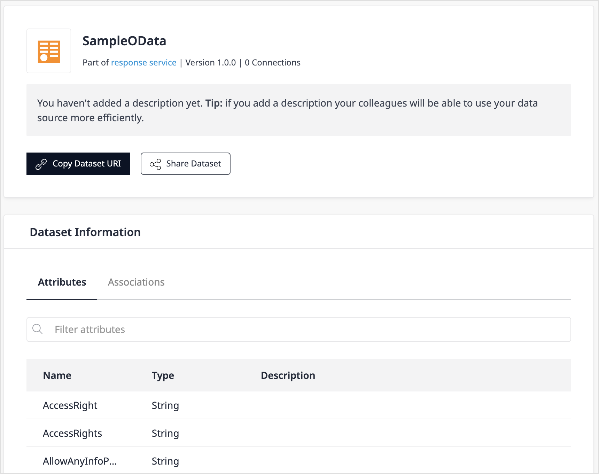
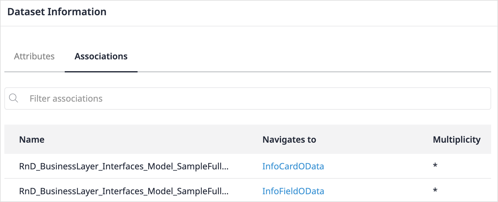
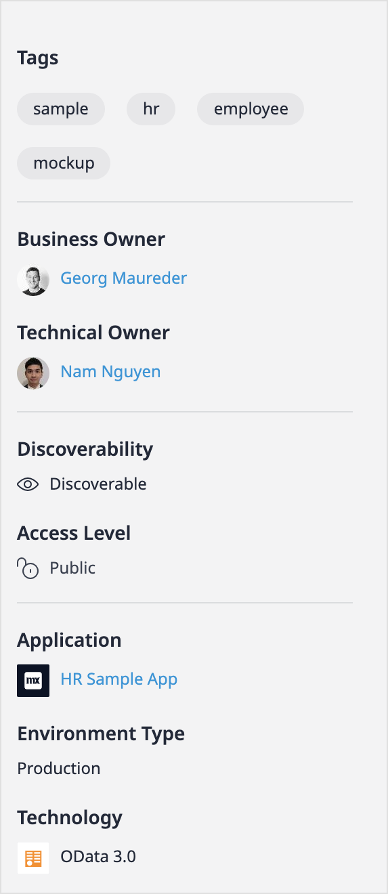

## 1 Introduction

Finding the right data to use in your app is made easier by the Data Hub Catalog search functionality. The metadata for a registered service is displayed in the [search details](#search-details) screen to help in identifying the correct data source to use to use in your app development. 

You can start searching from the [Data Hub](#data-hub-home) page or click the [Catalog](#search-tab) tab to go to the **Search** pane and **Search Details** screen.

The [Data Hub pane](/refguide/data-hub-pane) in Studio Pro enables search in the Data Hub Catalog to find and connect to registered entities from your Mendix app.

This page describes the search functionality of the Data Hub Catalog and the information that is displayed for registered assets.

## 2 Details of Registered Assets

The [search details](#search-details) screen for a registered service, entity, or attribute displays information as provided in the published OData service contract that is used to register assets in the Data Hub Catalog. Registered services and the exposed entities can be curated to provide additional information such as **Tags** and **Descriptions** to ensure that they can be found by the appropriate users.

### 2.1 Published OData Service 

The OData service document contains the data that is registered in the Data Hub Catalog. The contract of the published service (the *$metadata* document) contains the details of what is exposed in the service and further links to the metadata of the entities exposed in the service for attributes, associations, types, and accessibility. The published OData service that is registered is shown in search details. 

For details on creating a published OData service in Studio Pro, see [How to Register Data Assets](register).

### 2.2 Versions 

Every published OData service has a version number, and apps consuming from a service will consume from a specific version. Updates and changes to a service will be indicated by a change in the version number. There may be several versions of a service available in the catalog. These will all be listed as separate items in the search results for a service.

The [search details](#search-details) screen in the Data Hub Catalog will include the version of the selected service.

### 2.3 Environments

The Data Hub Catalog is a register of apps that are deployed to a particular environment and the services published from the apps deployed to the environment. This means that the catalog registers the version of a service running in a specific environment. The environmetn also indicates the quality of the dataset that is available. Shared datasets that are available from a *production environment* will have production-level data, while those in non-production environments (*acceptance*, *development*) will not be reliable for building stable apps but be useful for doing development work.

The search results will show these service endpoints (where a service endpoint is the combination of a service version deployed on a specific environment). So if a version of a service is deployed on both a test and acceptance environment, a search on the service name in the Data Hub Catalog will have two hits. 

The environment is therefore a major component of the definition and forms part of the URL for the endpoint being consumed. This, in combination with the OData version number, provides the link to the correct data for the entities that are exposed.

{}
By default, search results in the Data Hub Catalog is filtered to show only hits in the Production environment. You can extend the search to **Non-production** or **Mendix Free App (Sandbox)** environments by checking them in the search pane **Add Filter** list. For more details, see [Filters](#filter).
{}

### 2.4 URLs 
The service URLs provide the locations of the service contract. In turn, these define the endpoints for exposed entities and attributes and thereby access to the associated datasets by the consuming apps. 

### 2.5 Discoverability 
When a service is registered, by default it is "published" by being set to **Discoverable** in the Data Hub Catalog so that all users can find it and see details about it. Owners and curators of a registered service can set a service to be **non-discoverable**, which means that it can only be found and consumed by them and is not available to other users.

### 2.6 Tags 
Tags help you to group services and entities and categorize them (for example, by department, process, or use). You can use tags to refine the search and filter search results in the Data Hub Catalog by doing the following:

* Add tags to the service as a curate function in the Data Hub Catalog after a service is registered by service owners and [Data Hub Curators](../index#curator)
* Add different tags to the different versions of the same service, as they will be two separately registered assets in the catalog (this is also a way to make different version identifiable)
* Add tags to the entities exposed in the service
* Add tags in the [manual registration of OData v4 services](register#registration-form)

### 2.7 Description
The description that is included as part of the published service metadata. This description can be further curated at the service, entity, and attribute level by Data Hub Curators to provide further details of the exposed entities and associated datasets.

{}
In Studio Pro, when publishing an OData service, it is possible to specify a summary of the service and a description. Only the description is included in the OData service contract document and displayed in the Data Hub Catalog.
{}

### 2.8 Contacts for Registered Apps and Services 
In the Data Hub Catalog, the search details for a service include a **Technical Owner** (for technical inquiries) and the **Business Owner** who is responsible for the data sets. Both of these owners can curate their registered assets.

## 3 Searching in the Data Hub Catalog {#data-hub-home}

When searching in the Data Hub Catalog, the following fields are searched:

* Service Endpoint: Name, Description, Tags
* Application: Name
* Entity: Name, Description
* Attribute: Name, Description
* Association: Name

From the **Data Hub** page, you can search in the Data Hub Catalog in the following ways:

* Type a search term in the search box and click **Search** (search strings can comprise a minimum of 3 characters and include the alphanumeric characters)
* Click one of the *tags* given in the **Search suggestions**
* Click one of the services under **Most Popular Services**
* Click the **Catalog** tab

Any of the above actions will take you to the **Search** screen, which is described below.

## 4 Search Screen {#search-tab}

The **Search** screen is divided into the [search](#search-pane) pane on the left, the [search details](#search-details) of the selected asset in the centre panel, and the [service metadata](#metadata) panel on the right.

### 4.1 Search Pane {#search-pane}

The collapsable **Search** pane is used to search for registered assets in the Data Hub Catalog:

 {}{}

#### 4.1.1 Search Area

Enter a search string in the **Search** area of minimum of 3 alpha-numeric.

In Studio Pro, searching the Data Hub Catalog through the **Data Hub** pane requires use of the wildcard `*` for an empty search. It is not possible to use the wildcard in combination with other characters. The wildcard can also be used in the Data Hub Catalog search but it is not necessary. 

{}
Punctuation cannot be used as part of the search term except for the wildcard `*`. 
{}

{}
Search is case-insensitive.
{}

#### 4.1.2 Filters {#filter}

You can filter search results by environment type. By default, the **Production** environment filter is active to restrict search results to the production environment. The number of filters that are active for the current search is displayed adjacent to the filter: 

 {}{}

To specify the environment type for the search, click **Filter**:

In the **Filters** dialog box, check the **Environment Type** that you want to restrict your search to and click, **Apply Filters**. The search results will only display hits for the specified search string in the checked environments.

Click **Clear Filters** to clear all the checked environments and click **Apply Filters** to see search results in all environments.

{}
The **Sandbox** filter refers to apps deployed to the Mendix Free App environment. 
{}

#### 4.1.3 Search Results

The number of items satisfying the search criteria (search string plus filters) are shown at the top of the search results. Search results will include all application names, registered services, entities, attributes, tags, and descriptions satisfying the search string and filters. Th order of the search results will be a combination of the following:

* Closest match to the search string
* Popularity of the service (number of connections)

If no search string is specified, all registered assets will be listed in the search results in order of popularity (number of connections to the asset).

When an item in the search results is selected, the **Catalog** tab will show the **Search details** and the **Landscape** tab will show the network of connections and dependencies of the selected item in the [Data Hub Landscape](../data-hub-landscape/index).

### 4.2 Search Details {#search-details}

The Search Details displays the details of the selected item in the search results. 

#### 4.2.1 Search Details for a Selected Service

When a service is selected, the full details of the selected endpoint are displayed:

* The name of the Service
* The name of the environment to which the app is deployed
* The **Version** number of the service at this endpoint
* The number of environments (app in a specific environment) that consume the service (**Used in**)
* A description of the entity as given in the service metadata or curated in the Data Hub Catalog
* Clicking **Share Service** will copy the link to the this asset detail to the clipboard
* Each **Entity** that is exposed in the service (you can expand an entity to see details of the attributes and associations, as described below)

#### 4.2.2 Search Details for Selected Entity {#entity-details}

When an **Entity** is selected in the search results, details for the entity are displayed in the **Search Details** window:

* The name of the Service
* **Part of** contains a link that will take you to the asset details page of the service in which the entity is exposed
* The **Version** number of the service at the endpoint
* The number of environments (app in a specific environment) that consume the entity (**Used in**) 
* A description of the entity as given in the service metadata or curated in the Data Hub Catalog
* Clicking **Share Datasource** will copy the link to this entity detail page to the clipboard
* **Entity Information**

For every entity, the attributes exposed in the service are listed showing the attribute types and description.

Under the **Associations** tab for each entity, the associations are shown:

* **Name** – the name of the association that is exposed in the service
* **Navigates to** – the entity the association refers to. Click the link to see the details of the associated entity in the Catalog. 
* **Multiplicity** – the number of object at the other end of the association (0..1, 1 or *)

### 4.3 Service Metadata Panel {#metadata}

The service metadata panel at the right of the search details page displays details of the registered service from the OData metadata files and values that have been curated in the Data Hub Catalog:

 {}{}

* **Tags** – tags that have been assigned to the service when it has been [curated](curate#tags)
	{}Tags assigned at a service level propagate down to the entities and attributes exposed in the service.{}
* **Business Owner** – links to the business owner of the data that the service connects to; this is curated in the Data Hub Catalog
* **Technical Owner** – technical contact of the app; by default this is the owner who registered the service. For apps hosted in the Mendix Cloud, the **Technical Owner** is the **Technical Contact** of the app in the Mendix Cloud
* **Discoverability** – the discoverability of the service so that other users can find it:
	* **Discoverable** – all users of the Data Hub Catalog and Studio Pro can see and consume the service provided they meet the requirements of the **Classification**
	* **Non-Discoverable** – the service is not visible in the Catalog and only owners of the service, Data Hub Curators, and Data Hub Admins can find, use, and curate the service. See [Curate Bar](#curate-bar) for changing **Discoverability** as an owner of the service or curator.
	  {}If an asset is set to **Non-discoverable** it will not appear in the search results in the **Data Hub** pane of Studio Pro, or any other client of the Data Hub API.{}
* **Access Level** – shows the access classification of the service; end-users of the data associated with the entities exposed in the service must have the appropriate [user role](/refguide/user-roles) to have access to the data:
	* **Public** – this service is classified as public	
	* **Internal** – the service is restricted to the members of the organization
	{}Classifications at a service level propagate down to the entities and attributes exposed in the service. {}
* **Environment Type** – indicates the quality and the status of the datasets associated with the exposed entities by the environment that the app and service are deployed to. The following are the environment types: 
  * **Production**
  * **Non-Production** 
  * **Sandbox** (the Mendix Free App environment) 
* **Application** – link to the app in the given environment from which the OData service was published 

### 4.4 Curate Bar {#curate-bar}

The **Curate Bar** is displayed on the asset detail screen if you are the owner of the selected asset or a curator indicating that you can curate the asset. You can perform the following actions:
* **Edit Metadata** – edit the registered metadata and add catalog descriptions and tags: 
  * when a service is selected, you can edit **Application Details**, and **Service Details**
  *  when an entity is selected you can **Edit Entity Details**
* **Discoverable**/**Validated** – set the discoverability of the service, and validate the dataset
  * **Discoverable** – all users of Data Hub Catalog and Studio Pro can see and consume the service in combination with the classification of the asset
  * **Non-Discoverable** – the service is not visible and only owners of the service, Data Hub Curators, and Data Hub Admins can find and use the service
  * **Validated** – indicate if the dataset has been validated

{}By default, newly registered services are set to **Discoverable** and visible to all users. {}

For further details on curating registered assets see [Curation](./curate).

## 5 Viewing Search Results in the Data Hub Landscape

When an item is selected in the search results pane, you can click the [Landscape](../data-hub-landscape/index) tab to see the network of connections and dependencies for the selected asset. This enables you to graphically see the context and relevance for a selected item and the data for the exposed entities.
